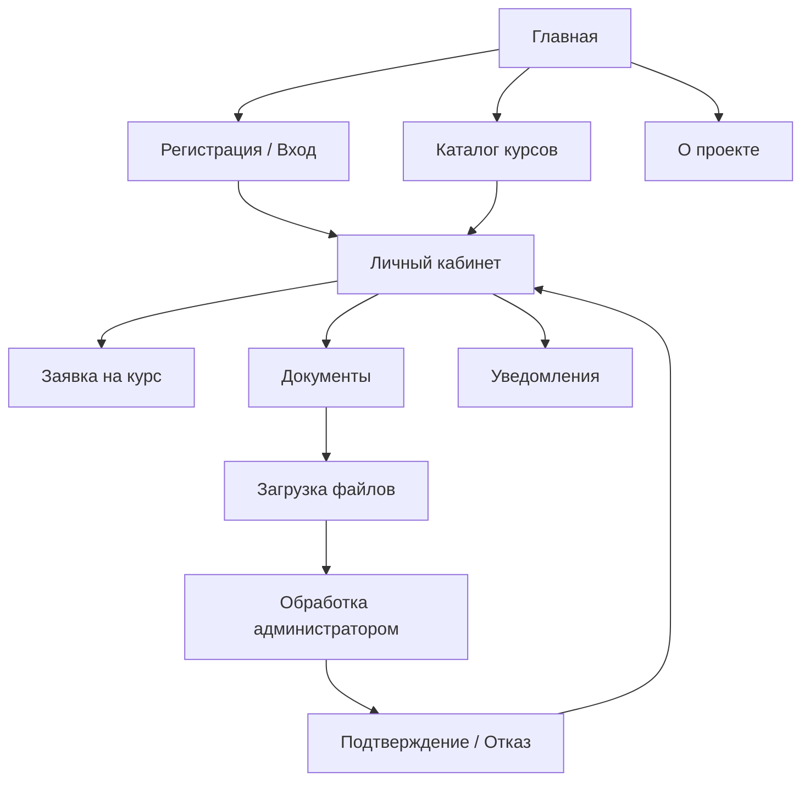
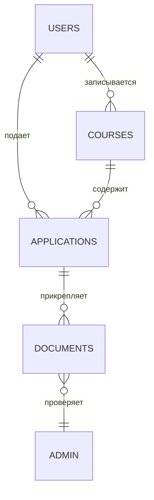

# 📘 DPO Project

## 📖 Описание

Проект представляет собой систему для взаимодействия студентов, преподавателей и администрации в рамках дополнительного профессионального образования (ДПО). Он включает веб-интерфейс, базы данных и связанный документооборот.

---

## 📂 Структура каталогов

```
DPO/
├── docs/              # Документы и инструкции
├── sql/               # SQL-скрипты для базы данных
├── src/               # Исходный код (HTML, JS, CSS)
├── forms/             # Формы и шаблоны заявок
├── reports/           # Отчеты и выгрузки
└── README.md          # Описание проекта
```

---

## 🚀 Запуск проекта

1. Установите локальный сервер (например, XAMPP или Node.js).
2. Разверните базу данных:

   ```bash
   psql -U postgres -f sql/init.sql
   ```
3. Откройте `src/index.html` в браузере.
4. Для тестирования форм используйте тестовые данные из `docs/test-data.xlsx`.

---

## 📌 Известные проблемы

* ❌ Некоторые формы не имеют валидации email и телефона.
* ❌ SQL-скрипты требуют доработки: есть конфликты с `NOT NULL` и внешними ключами.
* ❌ Навигация между страницами не всегда последовательна.

---

## 🛠 Рекомендации

* Добавить серверную валидацию всех форм.
* Проверить корректность всех связей в БД.
* Объединить UI-стили в единый CSS.
* Дополнить документацию примерами API-запросов.

---

## 🔗 Логика взаимодействия страниц



---

## 🗄 Логика базы данных



---

## 🎯 Дальнейшее развитие

* 📌 Вынести бизнес-логику на сервер (например, Django / Express).
* 📌 Реализовать REST API для интеграции с внешними системами.
* 📌 Подключить систему уведомлений (Email, Telegram-бот).
* 📌 Добавить тестирование (Unit-тесты и e2e-тесты).

---

## Архитектурная диаграмма (Mermaid)

```mermaid
flowchart TD
    %% Client Layer
    Browser["Web Browser"]:::frontend

    %% Web Server Layer
    WebServer["Apache/Nginx + PHP-FPM"]:::server

    %% Application Layer
    subgraph "Application Layer"
        subgraph "Authentication & Security" 
            AuthModule["Auth & Security Module"]:::module
        end
        subgraph "Course & Module Management"
            CourseModule["Course & Module Module"]:::module
        end
        subgraph "Quiz & Exam Engine"
            QuizModule["Quiz & Exam Module"]:::module
        end
        subgraph "Document Upload & Approval"
            DocModule["Document Upload & Approval Module"]:::module
        end
        subgraph "Administration Dashboard"
            AdminModule["Admin Dashboard Module"]:::module
        end
        subgraph "Teacher Dashboard"
            TeacherModule["Teacher Dashboard Module"]:::module
        end
    end

    %% Data Layer
    subgraph "Data Layer"
        DB["Relational Database"]:::database
        FileStore["File Storage (/uploads)"]:::filesystem
    end

    %% External Services
    subgraph "External Services"
        EmailService["SMTP / Email Service"]:::external
    end

    %% Connections
    Browser -->|HTTP(S) requests| WebServer
    WebServer -->|invoke| AuthModule
    WebServer -->|invoke| CourseModule
    WebServer -->|invoke| QuizModule
    WebServer -->|invoke| DocModule
    WebServer -->|invoke| AdminModule
    WebServer -->|invoke| TeacherModule

    AuthModule -->|"SELECT/INSERT"| DB
    CourseModule -->|"SELECT/INSERT"| DB
    QuizModule -->|"SELECT/INSERT"| DB
    DocModule -->|"store files"| FileStore
    DocModule -->|"SELECT/INSERT"| DB
    AdminModule -->|"SELECT/INSERT"| DB
    TeacherModule -->|"SELECT/INSERT"| DB

    AuthModule -->|"send email"| EmailService

    %% Click Events - Authentication & Security
    click AuthModule "https://github.com/olegmto/bgitu_do/blob/main/login.php"
    click AuthModule "https://github.com/olegmto/bgitu_do/blob/main/logout.php"
    click AuthModule "https://github.com/olegmto/bgitu_do/blob/main/register.php"
    click AuthModule "https://github.com/olegmto/bgitu_do/blob/main/forgot_password.php"
    click AuthModule "https://github.com/olegmto/bgitu_do/blob/main/reset_password.php"
    click AuthModule "https://github.com/olegmto/bgitu_do/blob/main/verify_email.php"
    click AuthModule "https://github.com/olegmto/bgitu_do/blob/main/config/security.php"

    %% Click Events - Course & Module Management
    click CourseModule "https://github.com/olegmto/bgitu_do/blob/main/courses.php"
    click CourseModule "https://github.com/olegmto/bgitu_do/blob/main/course.php"
    click CourseModule "https://github.com/olegmto/bgitu_do/blob/main/admin_add_course.php"
    click CourseModule "https://github.com/olegmto/bgitu_do/blob/main/admin_edit_course.php"
    click CourseModule "https://github.com/olegmto/bgitu_do/blob/main/admin_manage_course.php"
    click CourseModule "https://github.com/olegmto/bgitu_do/blob/main/admin_manage_courses.php"
    click CourseModule "https://github.com/olegmto/bgitu_do/blob/main/admin_add_module.php"
    click CourseModule "https://github.com/olegmto/bgitu_do/blob/main/teacher_courses.php"

    %% Click Events - Quiz & Exam Engine
    click QuizModule "https://github.com/olegmto/bgitu_do/blob/main/exam.php"
    click QuizModule "https://github.com/olegmto/bgitu_do/blob/main/get_exam_data.php"
    click QuizModule "https://github.com/olegmto/bgitu_do/blob/main/get_quiz_data.php"
    click QuizModule "https://github.com/olegmto/bgitu_do/blob/main/exam_results.php"
    click QuizModule "https://github.com/olegmto/bgitu_do/blob/main/admin_add_quiz.php"
    click QuizModule "https://github.com/olegmto/bgitu_do/blob/main/admin_add_exam.php"

    %% Click Events - Document Upload & Approval
    click DocModule "https://github.com/olegmto/bgitu_do/blob/main/admin_add_material.php"
    click DocModule "https://github.com/olegmto/bgitu_do/blob/main/config/file_functions.php"
    click DocModule "https://github.com/olegmto/bgitu_do/tree/main/uploads/"

    %% Click Events - Administration Dashboard
    click AdminModule "https://github.com/olegmto/bgitu_do/blob/main/admin_dashboard.php"
    click AdminModule "https://github.com/olegmto/bgitu_do/blob/main/admin_login.php"

    %% Click Events - Teacher Dashboard
    click TeacherModule "https://github.com/olegmto/bgitu_do/blob/main/teacher_dashboard.php"
    click TeacherModule "https://github.com/olegmto/bgitu_do/blob/main/teacher_students.php"

    %% Click Events - Data Layer & Setup
    click DB "https://github.com/olegmto/bgitu_do/blob/main/config/database.php"
    click DB "https://github.com/olegmto/bgitu_do/blob/main/install.php"
    click DB "https://github.com/olegmto/bgitu_do/blob/main/seed_data.php"
    click DB "https://github.com/olegmto/bgitu_do/blob/main/test_connection.php"

    %% Styles
    classDef frontend fill:#AED6F1,stroke:#1F618D,color:#1F618D
    classDef server fill:#ABEBC6,stroke:#196F3D,color:#196F3D
    classDef module fill:#F9E79F,stroke:#B7950B,color:#B7950B
    classDef database fill:#F5B7B1,stroke:#CB4335,color:#CB4335
    classDef filesystem fill:#D5DBDB,stroke:#424949,color:#424949
    classDef external fill:#D7BDE2,stroke:#6C3483,color:#6C3483

```

---

© 2025, DPO Project
