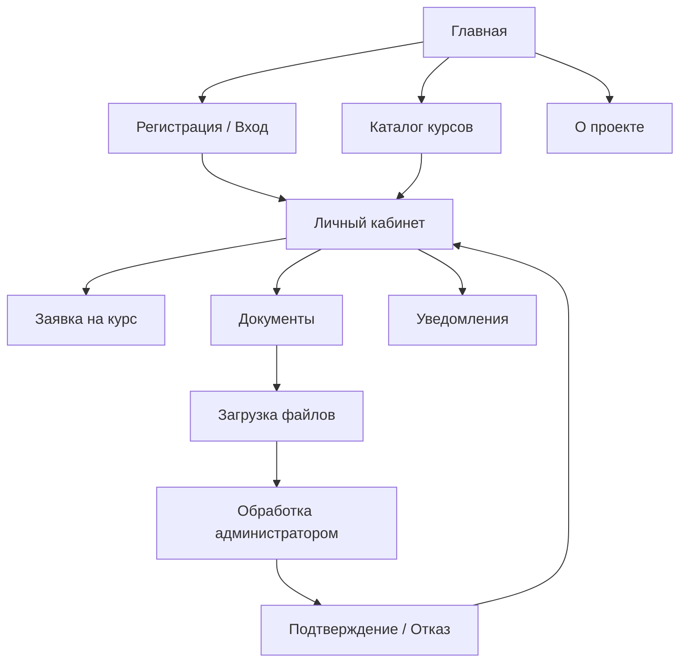
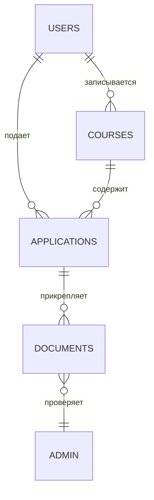

# 📘 DPO Project

## 📖 Описание

Проект представляет собой систему для взаимодействия студентов, преподавателей и администрации в рамках дополнительного профессионального образования (ДПО). Он включает веб-интерфейс, базы данных и связанный документооборот.

---

## 📂 Структура каталогов

```
DPO/
├── docs/              # Документы и инструкции
├── sql/               # SQL-скрипты для базы данных
├── src/               # Исходный код (HTML, JS, CSS)
├── forms/             # Формы и шаблоны заявок
├── reports/           # Отчеты и выгрузки
└── README.md          # Описание проекта
```

---

## 🚀 Запуск проекта

1. Установите локальный сервер (например, XAMPP или Node.js).
2. Разверните базу данных:

   ```bash
   psql -U postgres -f sql/init.sql
   ```
3. Откройте `src/index.html` в браузере.
4. Для тестирования форм используйте тестовые данные из `docs/test-data.xlsx`.

---

## 📌 Известные проблемы

* ❌ Некоторые формы не имеют валидации email и телефона.
* ❌ SQL-скрипты требуют доработки: есть конфликты с `NOT NULL` и внешними ключами.
* ❌ Навигация между страницами не всегда последовательна.

---

## 🛠 Рекомендации

* Добавить серверную валидацию всех форм.
* Проверить корректность всех связей в БД.
* Объединить UI-стили в единый CSS.
* Дополнить документацию примерами API-запросов.

---

## 🔗 Логика взаимодействия страниц



---

## 🗄 Логика базы данных



---

## 🎯 Дальнейшее развитие

* 📌 Вынести бизнес-логику на сервер (например, Django / Express).
* 📌 Реализовать REST API для интеграции с внешними системами.
* 📌 Подключить систему уведомлений (Email, Telegram-бот).
* 📌 Добавить тестирование (Unit-тесты и e2e-тесты).

---

© 2025, DPO Project
